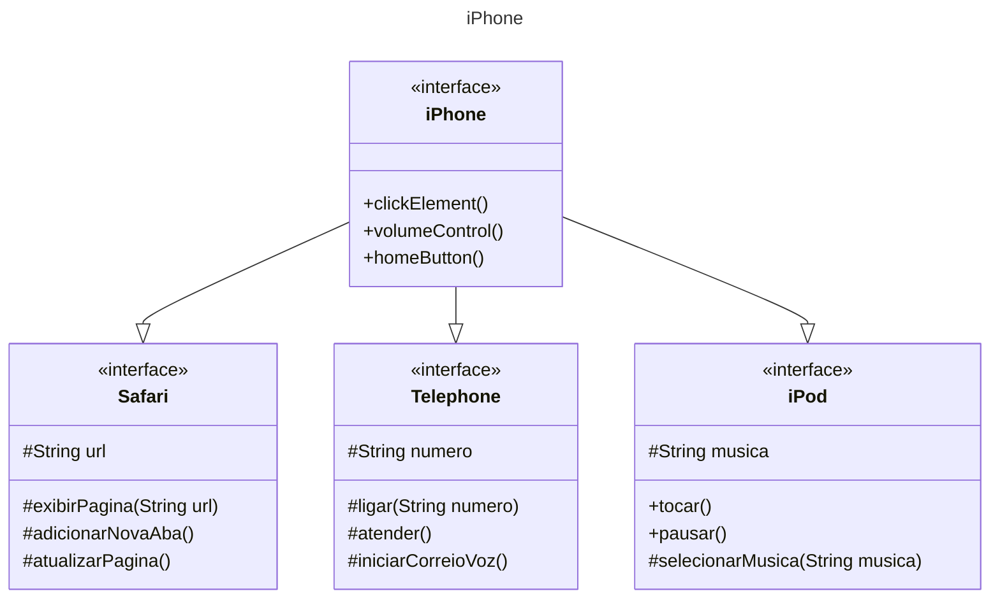

</h3>Projecting the first iPhone using Java

### About the Project
This project is part of a Bootcamp created by DIO in partnership with Claro. The idea is to implement the first iPhone using [OOP(Object-Oriented Programming)](https://www.w3schools.com/java/java_oop.asp) and UML to describe the relantionship between the objects and classes. Obviously It's not even close to the real way to implement a real iPhone, but It's a interesting way to use some important concepts such as OOP.

### UML implemetation

